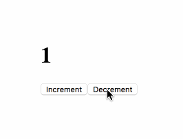

# OMG Counters   

↕️️ Increment/decrement counters using various frontend frameworks.

### _When a hello world is too simple, but a todo app is too complex._



_No counters were harmed in the making of these examples._

### Table of Contents

<!-- START doctoc generated TOC please keep comment here to allow auto update -->
<!-- DON'T EDIT THIS SECTION, INSTEAD RE-RUN doctoc TO UPDATE -->


- [Vanilla JS](#vanilla-js)
- [jQuery](#jquery)
- [RxJS](#rxjs)
- [React](#react)
- [React + Redux](#react--redux)
- [AngularJS](#angularjs)
- [Angular 2+](#angular-2)
- [Hyperapp](#hyperapp)
- [Vue.js](#vuejs)
- [Elm](#elm)
- [Cycle.js](#cyclejs)
- [Jumpsuit](#jumpsuit)
- [Mobx](#mobx)

<!-- END doctoc generated TOC please keep comment here to allow auto update -->

# Vanilla JS

```js
// html
// ----
// <h1 class="count"></h1>
// <button class="increment" onclick="increment()">Increment</button>
// <button class="decrement" onclick="decrement()">Decrement</button>

let count = 0
const $count = document.getElementsByClassName('count')[0]
$count.textContent = count
function increment() { $count.textContent = ++count }
function decrement() { $count.textContent = --count }
```

[Live Example on WebpackBin](http://www.webpackbin.com/NyXDu7ytz)

# jQuery

```js
// html
// ----
// <h1 class="count"></h1>
// <button class="increment">Increment</button>
// <button class="decrement">Decrement</button>

let count = 0
$('.count').text(count)
$('.increment').on('click', () => $('.count').text(++count))
$('.decrement').on('click', () => $('.count').text(--count))
```

[Live Example on WebpackBin](http://www.webpackbin.com/VyZb9Z1KG)

# RxJS

```js
// html
// ----
// <h1 id="count"></h1>
// <button id="increment">Increment</button>
// <button id="decrement">Decrement</button>

const $factory = id => Rx.Observable.fromEvent(document.getElementById(id), 'click')
const setCount = count => document.getElementById('count').textContent = count

const inc$ = $factory('increment').mapTo(1)
const dec$ = $factory('decrement').mapTo(-1)

Rx.Observable.merge(inc$, dec$)
  .startWith(0)
  .scan((a, b) => a + b)
  .subscribe(setCount)
```

[Live Example on WebpackBin](http://www.webpackbin.com/NkLKZwkFM)

# React

```js
class Counter extends React.Component {
  state = {count: 0}

  increment = e =>
    this.setState({ count: this.state.count + 1 })

  decrement = e =>
    this.setState({ count: this.state.count - 1 })

  render = () =>  
    <div>
      <h1>{this.state.count}</h1>
      <button onClick={this.increment}>Increment</button>
      <button onClick={this.decrement}>Decrement</button>
    </div>
}
```

[Live Example on WebpackBin](http://www.webpackbin.com/4kvMWMkKG)

# React + Redux

```js
import { createStore } from 'redux'

const reducer = (state = 0, action) => {
  switch (action.type) {
    case 'INCREMENT': return state + 1
    case 'DECREMENT': return state - 1
    default: return state
  }
}

const store = createStore(reducer)

var Counter = ({ count, onIncrement, onDecrement }) => (
  <div>
    <h1>{count}</h1>
    <button onClick={onIncrement}>Increment</button>
    <button onClick={onDecrement}>Decrement</button>
  </div>  
)

const render = () => {
  ReactDOM.render(
    <Counter
      count={store.getState()}
      onIncrement={()=> store.dispatch({type: 'INCREMENT'})}
      onDecrement={()=> store.dispatch({type: 'DECREMENT'})}
    />,
    document.querySelector('body')
  )
}

store.subscribe(render)
render()
```

[Live Example on WebpackBin](http://www.webpackbin.com/N175AO1tz)

# AngularJS

```js
const CounterComponent = {
  template: `
   <div>
     <h1>{{ $ctrl.counter }}</h1>
     <button ng-click="$ctrl.increaseCounter()">Increment</button>
     <button ng-click="$ctrl.decreaseCounter()">Decrement</button>
   </div>
  `,
  controller: class CounterController {
    constructor() {
      this.counter = 0
    }

    increaseCounter() {
      this.counter++
    }

    decreaseCounter() {
      this.counter--
    }
  }
};

export default CounterComponent
```

[Live Example on WebpackBin](http://www.webpackbin.com/4JwFUVetz)

# Angular 2+

```js
import { Component } from '@angular/core';

@Component({
 selector: 'counter',
 template : `
   <div>
     <h1>{{counter}}</h1>
     <button (click)="onIncrement()">Increment</button>
     <button (click)="onDecrement()">Decrement</button>
   </div>
 `
})
export class CounterComponent {
 counter: number = 0;

 onIncrement() {
   this.counter++;
 }

 onDecrement() {
   this.counter--;
 }
}
```

[Live Example on WebpackBin](http://www.webpackbin.com/4kFun-lFM)

# Hyperapp

```js
app({
  model: 0,
  update: {
    add: model => model + 1,
    sub: model => model - 1
  },
  view: (model, actions) =>
    <div>
      <h1>{model}</h1>
      <button onclick={actions.add}>Increment</button>
      <button onclick={actions.sub}>Decrement</button>
    </div>
})
```

[Live Example on WebpackBin](http://www.webpackbin.com/VJ-dzMJYz)

# Vue.js

```js
// html
// ----
// <div id="app">
//   <h1>{{ count }}</h1>
//   <button v-on:click="increment">Increment</button>
//   <button v-on:click="decrement">Decrement</button>
// </div>

new Vue({
  el: '#app',
  data: { count: 0 },
  methods: {
    increment: function() { this.count++ },
    decrement: function() { this.count-- }
  }
})
```

[Live Example on WebpackBin](http://www.webpackbin.com/VyxxXfJYM)

# Elm

```elm
import Html exposing (beginnerProgram, div, h1, button, text)
import Html.Events exposing (onClick)


main =
  beginnerProgram { model = 0, view = view, update = update }


view model =
  div []
    [ h1 [] [ text (toString model) ]
    , button [ onClick Increment ] [ text "increment" ]
    , button [ onClick Decrement ] [ text "decrement" ]
    ]


type Msg = Increment | Decrement


update msg model =
  case msg of
    Increment ->
      model + 1

    Decrement ->
      model - 1
```

[Live Example](http://elm-lang.org/examples/buttons)

# Cycle.js

```js
const xs = xstream.default
const {div, button, h1, makeDOMDriver} = CycleDOM

function main(sources) {
  const action$ = xs.merge(
    sources.DOM.select('.dec').events('click').mapTo(-1),
    sources.DOM.select('.inc').events('click').mapTo(+1)
  )
  const count$ = action$.fold((x, y) => x + y, 0)
  const vdom$ = count$.map(count =>
    div([
      h1(count.toString()),
      button('.dec', 'Decrement'),
      button('.inc', 'Increment')
    ])
  )
  return { DOM: vdom$ }
}
```

[Live Example on JSBin](https://jsbin.com/huxoduh/1/edit?html,js,output)

# Jumpsuit

```js
const CounterState = State({
  initial: { count: 0 },
  increment: ({ count }) => ({ count: count + 1 }),
  decrement: ({ count }) => ({ count: count - 1 })
})

const Counter = Component({
  render() {
    return (
      <div>
        <h1>{ this.props.count }</h1>
        <button onClick={ Actions.increment }>Increment</button>
        <button onClick={ Actions.decrement }>Decrement</button>
      </div>
    )
  }
}, (state) => ({ count: state.counter.count }))

const globalState = { counter: CounterState }
Render(globalState, <Counter/>)
```

[Live Example on WebpackBin](http://www.webpackbin.com/4JkiMmkKM)

# Mobx

```js
const store = new class CounterStore {
  @observable count = 0;
  @action increment = () => this.count++;
  @action decrement = () => this.count--;
}

const Counter = observer(() => {
  return (
    <div>
      <h1>{store.count}</h1>
      <button onClick={store.increment}>Increment</button>
      <button onClick={store.decrement}>Decrement</button>
    </div>
  )
})
```

[Live Example on JSBin](http://jsbin.com/zedoco/2/edit?js,output)
